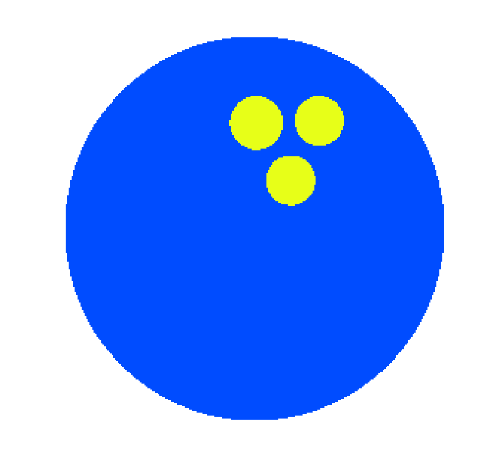
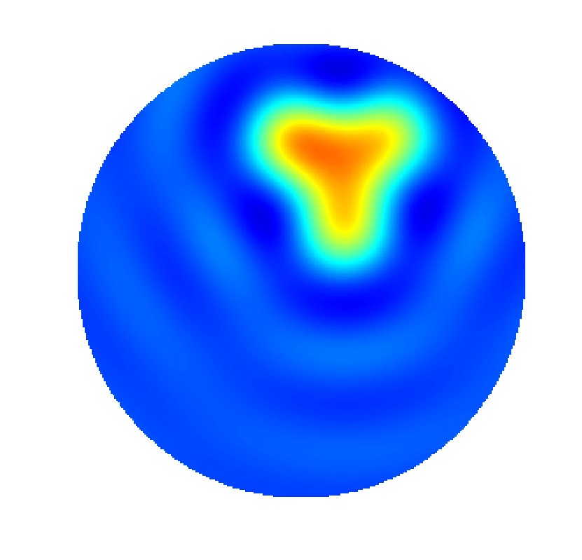
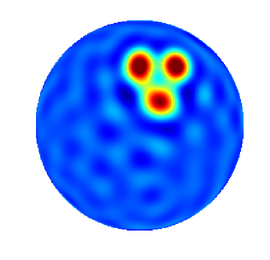

PSWF-Radon approach for 2D/3D
======================

PSWF-Radon approach allows to recover unknown function from its Fourier transform in 2D/3D being truncated to a finite euclidean ball. 
In comparison with conventional method where unknown part of Fourier spectrum is extrapolated with zeros, we recover this part (up to some limit) 
using theory of one-dimensional [Prolate Spheroidal Wave Functions](https://en.wikipedia.org/wiki/Prolate_spheroidal_wave_function).  

Recovery of high frequencies of the signal allows to achieve [super-resolution](https://en.wikipedia.org/wiki/Super-resolution_imaging) while the choice of tuning parameters is fully automatic. 

    
    &nbsp; 
    
    &nbsp;
    

This repository contains an implementation of PSWF-Radon algorithm and related numerical experiments from 

 1. _PSWF-Radon approach to reconstruction from band-limited Hankel transform_ by Fedor Goncharov, Mikhail Isaev, Roman Novikov, Rodion Zaytsev, 2024
    [HAL](https://hal.science/hal-04714552) [ArXiv](http://arxiv.org/abs/2409.17409)

 2. _Super-resolution reconstruction from truncated Hankel trasnform_ by Fedor Goncharov, Mikhail Isaev, Roman Novikov, Rodion Zaytsev, 2024 
    [HAL](https://hal.science/hal-04714586)

Original papers introducing PSWF-Radon approach are:

  3. _Reconstruction from the Fourier transform on the ball via prolate spheroidal wave functions_ Mikhail Isaev, Roman Novikov, 2022
  [journal](https://www.sciencedirect.com/science/article/pii/S0021782422000617)

  4. _Numerical reconstruction from the Fourier transform on the ball using prolate spheroidal wave functions_ Mikhail Isaev, Roman Novikov, Sabinin Grigory, 2024 [journal](https://link.springer.com/chapter/10.1007/978-3-031-41665-1_7)

## One word before

Code for PSWF-Radon approach is developed for [Octave](https://octave.org) on basis of [Scatter/Spheroidal library](https://github.com/radelman/scattering) originally designed for [Matlab](https://www.mathworks.com/products/matlab) (current repository is a _fork_ from this library). 
We use only part of this libary to _pre-compute_ Prolate Spheroidal Wavefunctions (PSWFs) which are later used in PSWF-Radon approach for reconstructions.

## Requirements & Installation

#### Required libraries/software

* Linux-kernel OS with `Octave 8.4.0`
*  installed [NFFT library](https://www-user.tu-chemnitz.de/~potts/nfft/) - for installation read the corresponding guidline from [here](https://www-user.tu-chemnitz.de/~potts/nfft/installation.php); we also advise you to build it with flags
    * `--enable-all`

    * `--enable-openmp`

    * `--with-matlab=<path-to-save Matlab's MEX and .m files>` - compile NFFT into Matlab's MEX binaries, Octave will make calls to these functions

* [GNU MPFR libary](https://www.mpfr.org)

In principle, it is possible to adapt our implementation for Windows if, for example, you 

* use Matlab instead of Octave (this requires minimal changes of our codes due to close  syntaxes)

* build NFFT for Windows with the above flag to enable support of Matlab

#### Building binaries 

1. copy this repository on your local machine (e.g. via `git clone` or download ZIP archive and unpack it)

2. go to your home `.octaverc` and add path to compiled NFFT library for Matlab by adding line

        addpath(<path to folder with NFFT>)

    *Note*: folder `<path to folder with NFFT>` should contain `nfftmex.mex`, `nfft_get_*.m`, `nfft_set_*.m` and other Matlab's scripts for NFFT

3. build binaries for computation of PSWFs

        cd <path-to-folder with project>/spheroidal/sphwv; make

#### Pre-computation of PSWFs

1. in Octave go to folder of this repo 

        cd <path-to-folder of this repo>

2. add paths 

        cd spheroidal; sandbox; 

3. to sample PSWFs up to order `n_max` for frequency parameter `c` with equispaced `n_points` on `[-1,1]` run

        generate_data_for_pswfs_m0_only(c, n_max, n_points)

    this command may take some time and will take some hard-drive memory as it samples PSWFS and stores them in files in `/data` folder.   
    To run codes from our papers run the above command for `c=10` and `c=15` with `n_max=29`, `n_points=1024`.

## Running scripts for Papers 1, 2

1. run Octave

2. go to folder of this repo

        cd <path-to-folder of this repo>

3. add all necessary paths

        sandbox; cd prolate-2d-3d; sandbox; cd ../spheroidal; sandbox

4. check that current `pwd` should be `<path-to-folder of this repo>/spheroidal`

        pwd

5. in Octave's script editor open files 
    
    1. `<path-to-folder of this repo>/prolate-2d-3d/generate-scripts/generateArticleImages.m` - codes for Paper 1

    2. `<path-to-folder of this repo>/prolate-2d-3d/generate-scripts/generateMultipoleReconstructions.m` - codes for Paper 2

6. select pieces of code with your cursor and run them (in Octave to run selected text is `F9` key; logical pieces of code 
are separated with multiline comments)

**Important note:** simulations for 3D case in Paper 1 may require significant amount of RAM as one of the routines being called 
is the inverse Radon transform implemented using NFFT (up to 80GB in our experiments). 

## Playground

All codes related to PSWF-Radon approach are stored in `<path-to-folder of this repo>/prolate-2d-3d/`.  
Check source codes there if you want to develop your own simulations.

The scattering library
======================

Routines for computing the analytical solutions to acoustic scattering problems involving prolate spheroids, oblate spheroids, and disks.

The software in this library is described in the following paper: http://scitation.aip.org/content/asa/journal/jasa/136/6/10.1121/1.4901318.

## Using the scattering library ##

1. Clone this repository to your local machine.
Alternatively, you can download this repository as a ZIP by clicking on the link to the right.
This will give you the entire repository, including not only the scattering library, but also the spheroidal library.

2. Open up MATLAB, and run `sandbox.m`.
This will set up all of the paths.

3. Run `generate_all_test_figures.m`.
This repository comes with the precomputed spheroidal wave functions necessary to generate these test figures.
It will generate four figures, saving each one as a PDF in the `images` directory.

4. To run `generate_figures.m`, you'll need to download more precomputed spheroidal wave functions at https://www.dropbox.com/s/tmqr3x05mpskinw/saved.zip?dl=0.
This ZIP is approximately 800 MB, so make sure you have enough disk space.
Unzip the contents of saved.zip into the `saved` directory.
Once done, run `generate_all_figures.m`, which will generate 11 figures, saving each one as a PDF in the `images` directory.

5. For those interested in lower-frequency stuff, you can download https://www.dropbox.com/s/sor9szivwbk7v5f/saved_small_c.zip?dl=0, which contains precomputed spheroidal wave functions for c = 0.1, 0.5, 1.0, and 5.0.

6. You can use the the spheroidal library to compute the spheroidal wave functions for values of c, m, and/or n that aren't included in either of these ZIPs.

## License ##

The scattering library is Copyright (c) 2014, Ross Adelman, Nail A. Gumerov, and Ramani Duraiswami, and is released under the BSD 2-Clause License (http://opensource.org/licenses/BSD-2-Clause).

The spheroidal library
======================

The spheroidal library includes routines for computing the spheroidal wave functions, and is located in the `spheroidal` directory.

Third-party software
====================

This repository contains four libraries from the MATLAB Central File Exchange.
They are:

1. `export_fig` by Oliver Woodford (http://www.mathworks.com/matlabcentral/fileexchange/23629-export-fig)

2. `cubehelix` by Stephen Cobeldick (http://www.mathworks.com/matlabcentral/fileexchange/43700-cubehelix-colormaps)

3. `legendflex` by Kelly Kearney (http://www.mathworks.com/matlabcentral/fileexchange/31092-legendflex--a-more-flexible-legend)

4. `spaceplots` by Aditya (http://www.mathworks.com/matlabcentral/fileexchange/35464-spaceplots)

These four libraries were released under their own licenses, which can be found along with their code in their respective directories in this repository.
